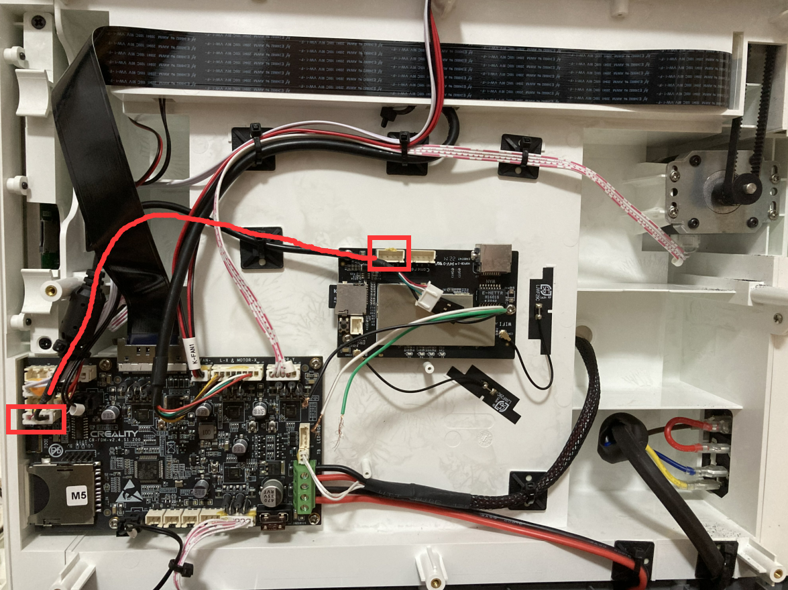
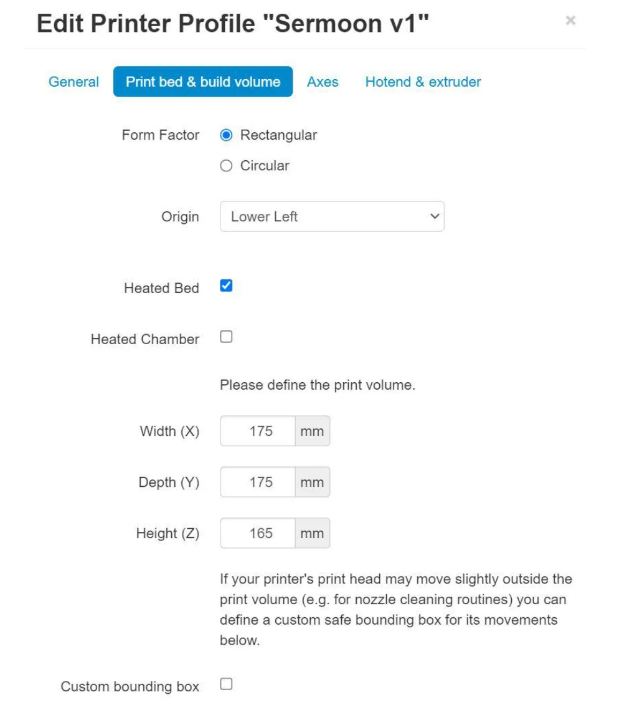
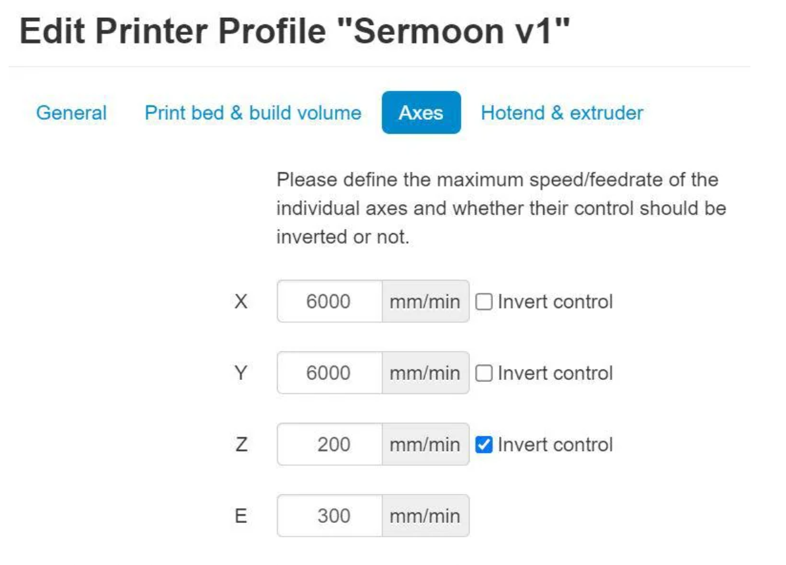
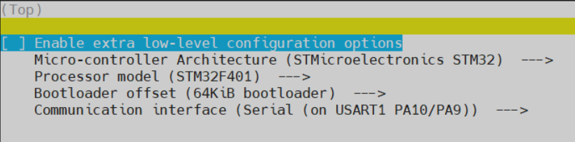

# 3DPrinters

3d打印折腾笔记

## 创想三维 Sermoon V1 改造篇

前些年买的第一台3d打印机就是Sermoon V1，封箱做的很漂亮，还是corexy。但是官方不给力，内置WiFi模组没啥用，也没有出扩展方案，看现在的宣传里都不带它，属于一个被舍弃的型号了。官方把它开源后，就全仗着开源社区小部分拥有者的支持。在我决定自组一台Voron之前，决定先把SermoonV1给DIY改造到相对满意的状态。

### 改造目标

1. 接上位机（闲置树莓派）
2. 刷Klipper，Fluidd，配置
   - （可选方案）KlipperScreen 
3. 裝CR-Touch，配置
4. 摄像头，配置

### SermoonV1接上位机

- 上位机有很多选型，我正好有一台吃灰树莓派3B，直接用。
- 两个使用方案：
  - Marlin方案：移除WiFi模组，继续保留原装Marlin固件，上位机安装OctoPrint
  - Klipper方案：移除WiFi模组，刷掉原装固件，上位机安装Klipper全家桶
- 我的经验是，一开始作为新人，我还是使用了Marlin方案很长一段时间，使用体验也不错，是个不需要怎么折腾的方案，如果不想继续DIY完全够用了。用了几个月后，还是馋Klipper，想要更深入学习打印机的更多知识，于是着手开始了Klipper方案。

#### SermoonV1接上位机-硬件部分

原理一句话，将主板连接WiFi模组的部分切换到树莓派。然后就是查阅资料验证一些细节，原本主板就是以USB的方式连WiFi模组，所以协议上，直接连树莓派是可以通的。主板上是的USB是以pin脚的形态，而非常见的插头，所以还要改造一根USB线：

USB的简单组成：4根线，分别是电源、地线、D+、D-。把主板的和树莓派的对应线接上即可，查阅到的资料都建议，不要将电源线接上，因为树莓派已经有额外的供电了，再接可能会烧。（如果树莓派没有额外供电，理论上是不是可以直接接主板的电源用？可能可以，但是没有试过，因为直接pin脚供电可能因为电流不稳搞坏树莓派，不去实验了）


拆开右侧板，右边框出来的pin脚就是主板和WiFi模块的连接，拔出来，取地线、D+、D-延长，可以从侧板的洞把线引出来。



在外面把线接上，懒得焊接，直接用接线端子。


硬件这块就完成了。

#### SermoonV1接上位机-Marlin方案

- 这个方案直接保留了原厂固件，所以只要树莓派安装OctoPrint即可，主打一个开箱即用。
- 用树莓派官方镜像烧录器，Other specific-purpose OS -> 3D printing -> OctoPi
- 树莓派开机，USB连上SermoonV1主板，OctoPrint会开机自启动，接着同个局域网下http打开ip地址或使用octopi.local这个域名，就能打开网页控制面板
- 第一次要配置下打印机，几个关键配置：
  - Serial port speed: 115200 baud
  - Bed dimesions: 175x175x165mm (XxYxZ)
  - Invert Z-axis control **注意这个**




最后感谢红迪的帖子：[Mod: OctoPrint setup for the Creality Sermoon V1 and V1 Pro](https://www.reddit.com/r/Creality_Sermoon_V1/comments/t2sh1t/mod_octoprint_setup_for_the_creality_sermoon_v1/)

#### SermoonV1接上位机-Klipper方案

推荐一开始就直接在树莓派上安装Kiauh，使用`$ ./kiauh.sh`会引导安装所有需要的软件。
推荐镜像：
    - Raspberry Pi OS Lite(32-bit) 这是Kiauh官方推荐，不包含桌面环境
    - Raspberry Pi OS (32-bit) 我用的这个，因为我这里树莓派的屏幕一定需要安装桌面环境才能驱动
因为网络原因最好上一个trojan，我这里就把用到的shell记录下。

```shell
# 安装trojan
sudo apt -y install build-essential cmake libboost-system-dev libboost-program-options-dev libssl-dev default-libmysqlclient-dev
git clone https://github.com/trojan-gfw/trojan.git
cd trojan/
mkdir build
cd build/
cmake ..
make
ctest
sudo make install
# 配置trojan节点
sudo vim /usr/local/etc/trojan/config.json
systemctl start trojan.service
systemctl status trojan.service

# kiauh
git clone https://github.com/dw-0/kiauh.git
# 执行kiauh
./kiauh.sh
```

依次安装Klipper, Moonraker, Fluidd, KlipperScreen 中途全部选Y。

然后开始编译给SermoonV1用的Klipper固件，在Kiauh的菜单里选`4) [Advanced] ` -> `2) [Build only] `，然后调整参数如下图。这是SermoonV1硬件参数，来源是Klipper内的SermoonV1配置文件，之后会提到。



选好后Klipper开始编译固件，最后输出`/home/pi/klipper/out/klipper.bin`。把这个二进制刷入SermoonV1，步骤依次是：

1. 空白SD卡，放入固件文件（似乎必须重命名为firmware开头）
2. SermoonV1断电，插卡，注意这里开始要断掉和树莓派的连接
3. SermoonV1通电，等待刷写成功，这时SermoonV1的屏幕就不能用了，不要管它显示的进度，保险起见等待20分钟
4. 断电，拔卡
5. 整个步骤参考[Creality官方固件刷写视频](https://www.crealitycloud.cn/post-detail/6225f8cfba434f6aecd9992a)

现在打开SermoonV1，连接树莓派上位机，通过浏览器输入ip地址进入Fluidd控制后台，之后的操作就是喜闻乐见的Klipper配置环节。

- 我的printer.cfg
- klipper官方的[针对SermoonV1的配置](https://github.com/Klipper3d/klipper/blob/master/config/printer-creality-sermoonV1-2022.cfg)，就是这里写明编译固件的硬件参数。

感谢这些资料：
- https://github.com/Klipper3d/klipper/pull/5621
- https://github.com/luxk3/sermoon_v1_pro_klipper_and_cr_touch_installation_guide
- https://s1nh.com/post/config-for-sermoonv1/
- https://www.youtube.com/watch?v=qI7M8NLOahg （评论区值得参考）
